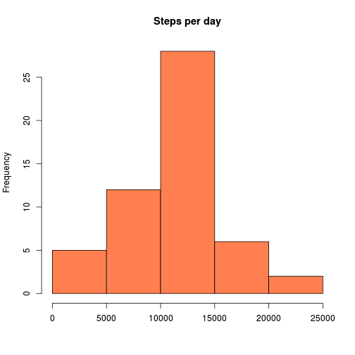
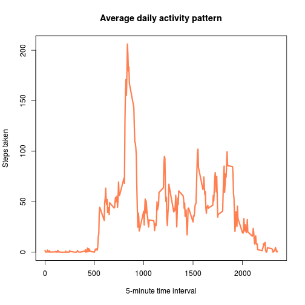
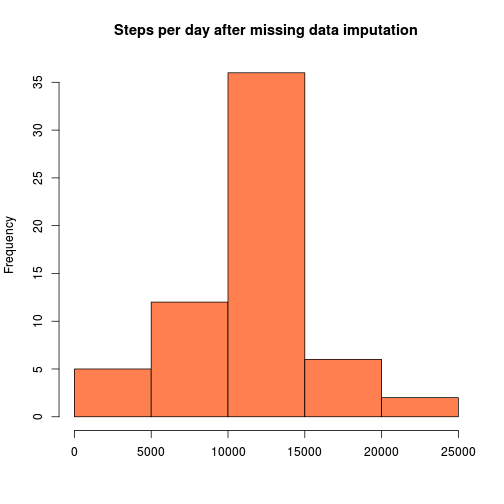
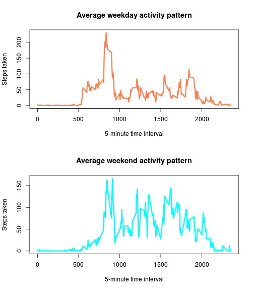

This assignment makes use of data from a personal activity monitoring device. This device collects data at 5 minute intervals through out the day. The data consists of two months of data from an anonymous individual collected during the months of October and November, 2012 and include the number of steps taken in 5 minute intervals each day.

## Loading and preprocessing the data

The data for this assignment can be downloaded from the course web site.


```r
#fileURL <- 'https://d396qusza40orc.cloudfront.net/repdata%2Fdata%2Factivity.zip'
#download.file(fileURL, destfile="dataset.zip", method="wget")
#unzip("dataset.zip")
```

The variables included in this dataset are:  
- steps: Number of steps taking in a 5-minute interval (missing values are coded as NA)  
- date: The date on which the measurement was taken in YYYY-MM-DD format  
- interval: Identifier for the 5-minute interval in which measurement was taken


```r
data_raw <- read.csv(file = 'activity.csv', header = TRUE, na.strings = NA, colClasses = c('integer', 'Date', 'integer'))
```

The dataset is stored in a comma-separated-value (CSV) file and there are a total of 17,568 observations in this dataset.


```r
str(data_raw)
```

```
## 'data.frame':	17568 obs. of  3 variables:
##  $ steps   : int  NA NA NA NA NA NA NA NA NA NA ...
##  $ date    : Date, format: "2012-10-01" "2012-10-01" ...
##  $ interval: int  0 5 10 15 20 25 30 35 40 45 ...
```

## What is mean total number of steps taken per day?

First we have to compute total number of steps taken per day.


```r
steps_per_day <- tapply(data_raw$steps, data_raw$date, sum)
```

Histogram of the total number of steps taken each day.


```r
hist(steps_per_day, main = "Steps per day", xlab = NA, col = "coral")
```

 

The mean of steps taken per day is ``1.0766189 &times; 10<sup>4</sup>`` and the median is ``10765``. 

## What is the average daily activity pattern?

Computing average daily activity pattern.


```r
average_day <- tapply(data_raw$steps, data_raw$interval, mean, na.rm = TRUE)
```

Time series plot of the 5-minute interval (x-axis) and the average number of steps taken, averaged across all days (y-axis)


```r
plot(names(average_day), average_day, type = "l", lwd = 3, col = "coral", main = "Average daily activity pattern", xlab = "5-minute time interval", ylab = "Steps taken")
```

 

5-minute interval, on average across all the days in the dataset, with the maximum number of steps is ``835``.


## Imputing missing values


```r
summary(data_raw)
```

```
##      steps             date               interval     
##  Min.   :  0.00   Min.   :2012-10-01   Min.   :   0.0  
##  1st Qu.:  0.00   1st Qu.:2012-10-16   1st Qu.: 588.8  
##  Median :  0.00   Median :2012-10-31   Median :1177.5  
##  Mean   : 37.38   Mean   :2012-10-31   Mean   :1177.5  
##  3rd Qu.: 12.00   3rd Qu.:2012-11-15   3rd Qu.:1766.2  
##  Max.   :806.00   Max.   :2012-11-30   Max.   :2355.0  
##  NA's   :2304
```

Summary statistists for the original data file shows that there are ``2304`` missing values for 'steps' variable.

Let's impute the missing values with daily average value for given interval computed in previous section.


```r
# split data into good and bad part
data_missing <- data_raw[is.na(data_raw$steps),]
data_missing$steps <- NULL
data_ok <- data_raw[!is.na(data_raw$steps),]

# impute missing data
data_imp <- data.frame(names(average_day), average_day)
names(data_imp) <- c("interval", "steps")
data_better <- merge(data_missing, data_imp)

# merge back good and updated part
data_full <- rbind(data_ok, data_better)
```

We have to compute total number of steps taken per day for the updated data set.


```r
steps_per_day_updated <- tapply(data_full$steps, data_full$date, sum)
```

Updated histogram of the total number of steps taken each day.


```r
hist(steps_per_day_updated, main = "Steps per day after missing data imputation", xlab = NA, col = "coral")
```

 

The mean of steps taken per day is now ``1.0766189 &times; 10<sup>4</sup>`` and the median is now ``1.0766189 &times; 10<sup>4</sup>``.

As we see, the mean has not changed and the median is slightly higher than before missing data imputation.

## Are there differences in activity patterns between weekdays and weekends?

Creating a new factor variable in the dataset with two levels ? ?weekday? and ?weekend? indicating whether a given date is a weekday or weekend day.


```r
data_full$day_type <- ifelse(weekdays(data_full$date) %in% c('sobota', 'niedziela'), 'weekend', 'weekday')
```

We want to create panel plot containing a time series plot of the 5-minute interval (x-axis) and the average number of steps taken, averaged across all weekday days or weekend days (y-axis). First of all we need to compute steps average for weekday and weekend.


```r
data_full$day_type <- ifelse(weekdays(data_full$date) %in% c('Saturday', 'Sunday'), 'weekend', 'weekday')

data_weekday <- data_full[data_full$day_type == 'weekday',]
data_weekend <- data_full[data_full$day_type == 'weekend',]

average_weekday <- tapply(data_weekday$steps, data_weekday$interval, mean)
average_weekend <- tapply(data_weekend$steps, data_weekend$interval, mean)
```

Now we can create a plot.


```r
par(mfcol=c(2,1))
plot(names(average_weekday), average_weekday, type = "l", lwd = 3, col = "coral", main = "Average weekday activity pattern", xlab = "5-minute time interval", ylab = "Steps taken", )
plot(names(average_weekend), average_weekend, type = "l", lwd = 3, col = "cyan", main = "Average weekend activity pattern", xlab = "5-minute time interval", ylab = "Steps taken")
```

 
